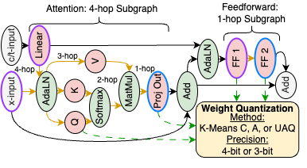

# Quantifiable Quantization Sensitivity of Diffusion Models [[website](https://kgmills.github.io/projects/qua2sedimo/)] [[paper](https://arxiv.org/abs/2412.14628)]

<p align="center">
    <a href="https://aaai.org/Conferences/AAAI-23/" alt="Conference">
        </a>
    <a href="https://github.com/Ascend-Research/AIO-P/blob/master/LICENSE" alt="License">
        </a>
    <a href="https://www.python.org/" alt="Python">
        </a>
    <a href="https://pytorch.org/" alt="PyTorch">
        </a>
    <a href="https://pytorch.org/" alt="Diffusers">
        </a>
<p/>

Repository for the paper
> [Qua<sup>2</sup>SeDiMo: Quantifiable Quantization Sensitivity of Diffusion Models](https://arxiv.org/pdf/2412.14628)) \
> Keith G. Mills, Mohammad Salameh, Ruichen Chen, Negar Hassanpour, Wei Lu, Di Niu \
> AAAI-25

<p align="center">
  
</p>

## High-Level Organization

The code for this paper is split into two top-level repos:
1) This repo, a fork of `q-diffusion` (ICCV'23; https://github.com/Xiuyu-Li/q-diffusion), which handles actually using the diffusion models (DMs), e.g., sampling and labeling random quantization configurations and performing inference on quantized models. 
2) `AutoBuild`, folder, [which can be found here](https://github.com/Ascend-Research/AutoBuild/tree/qua2sedimo). This is a branch of the original repository This is used for training predictors to generate subgraph scores and quantization configurations. Quantization sensitivity insight generation and analysis is handled here.

Additional directories with content:
1) `dag_plots` contains PNG images of what the PixArt, Hunyuan, DiT, SDv1.5 and SDXL denoiser architectures look like as Directed Acyclic Graphs. The PixArt and Hunyuan images cover a subset of the transformer layers due to a rendering issue with graphviz.

The rest of this README concerns quantized diffusion model inference and sampling quantization configurations.

## Environment Setup
Clone this repository, and then create and activate a suitable conda environment named `qua2sedimo` by using the following command:

```bash
conda env create -f environment.yml
conda activate qua2sedimo
```

## Inference Using Quantized Denoiser Networks

Inference of quantized DM denoisers requires two files:
1) The multiquantizer `*_mq.pt` checkpoint file for a given denoiser network. These files describe the quantization methods and bit precisions for each weight layer in a given denoiser network. As such, these files are usually several gigabytes in size. For simplicity, download them from the [Google Drive](https://drive.google.com/drive/folders/19gTl00BfDaQSQMlOC_aM5MMPo6grHC_1?usp=sharing) and place in a new subdirectory labeled `/multiquantizers/`. Alternatively, generate your own checkpoints by looking at the `Generating Multiquantizer Checkpoints` section below.
2) The file `*.pkl` file for the quantization configuration of a specific denoiser network. These configurations are found using Qua<sup>2</sup>SeDiMo predictors using the `AutoBuild` repo. We provide several key quantization configurations from our paper - download them from the [Google Drive](https://drive.google.com/drive/folders/19gTl00BfDaQSQMlOC_aM5MMPo6grHC_1?usp=sharing) and place them in a new subdirectory labeled `/quant_configs/`. For further information on how they are created, see the `AutoBuild` repository.

### Text-to-Image Diffusion Transformer Inference (PixArt & Hunyuan)

```
# PixArt-Alpha
python scripts/pixart_alpha_infer.py --outdir alpha_sample_w4a8 --q_config quant_configs/alpha_40.pkl --quant_act --act_bit 8 --prompt 'a lion riding a bike in Paris' --n_imgs 4
# PixArt-Sigma
python scripts/pixart_sigma_infer.py --outdir sigma_sample_w39a8 --q_config quant_configs/sigma_39.pkl --quant_act --act_bit 8 --prompt 'a lion riding a bike in Paris' --n_imgs 4
# Hunyuan-DiT
python scripts/hunyuan_infer.py --outdir hunyuan_sample_w4a8 --q_config quant_configs/hunyuan_40.pkl --quant_act --act_bit 8 --prompt 'a lion riding a bike in Paris' --n_imgs 4
```

#### Flags
* `--outdir` is the folder where results will be stored
* `--q_config` is the quantization configuration `.pkl` file
* `--quant_act` is the flag for enabling token-wise online activation quantization. If not set code programs to A16.
* `--act_bit` can be set to 8 or 6. Activation quantization bit precision. Disabled if `--quant_act` is not set.
* `--prompt` textual prompt you want to make an image of.
* `--n_imgs` number of images to make for given prompt.
* `--res` image resolution; 1024 for PixArt-Sigma and Hunyuan, while 512 for all other models.
* `--seed` random seed.

### Text-to-Image U-Net Inference (SDXL and SDv1.5)
```
# SDXL
python scripts/sdxl_infer.py --outdir sdxl_sample_w37a16 --q_config quant_configs/sdxl_37.pkl --prompt 'a lion riding a bike in Paris' --n_imgs 4
# SDv1.5
python scripts/sdv15_infer.py --outdir sdv15_sample_w4a16 --q_config quant_configs/sdv15_40.pkl --prompt 'a lion riding a bike in Paris' --n_imgs 4
```

For SDv1.5, you will need to download the checkpoint file `v1-5-pruned-emaonly.ckpt` from the [Google Drive](https://drive.google.com/drive/folders/19gTl00BfDaQSQMlOC_aM5MMPo6grHC_1?usp=sharing) and place it in `/models/ldm/stable-diffusion-v1/`.

### Class-Conditional Diffusion Transformer (DiT-XL/2)
```
python scripts/dit_infer.py --outdir dit_sample_w4a16 --q_config quant_configs/dit_40.pkl --cls_id 833 --n_imgs 4
```
* `--cls_id` refers to the ImageNet class you wish to generate images of. See [this link](https://deeplearning.cms.waikato.ac.nz/user-guide/class-maps/IMAGENET/) for a list.

#### FAQ
*I get an error 'AttributeError: 'HunyuanDiTPipeline' object has no attribute '_execution_device'*<br> To solve this, I go into the python definition of that class and replace all instances of `self._execution_device` with `torch.device("cuda:0")`. Is it hacky? Yes. Does it work. Yes.<br>
(**Note**: Doesn't have to be Hunyuan)


## Generating Multiquantizer Checkpoints
We cast denoiser neural networks as mixed-precision search spaces where we vary the bit-precision {3, 4} and quantization method {K-Means-C, K-Means-A and UAQ} of each weight layer. We sample and evaluate random quantization configurations for each denoiser neural network in order to train the Qua<sup>2</sup>SeDiMo predictors. 

To facilitate this, we implement multiquantizer checkpoints that store the quantization information (e.g., UAQ delta, K-Means centroids) for each bit precision/method for each weight layer in the neural network. 

These checkpoint files can be found on the [Google Drive](https://drive.google.com/drive/folders/19gTl00BfDaQSQMlOC_aM5MMPo6grHC_1?usp=sharing) and are several gigabytes in size. We provide instruction on how to re-create them should you so desire.<br>
**Note:** Running these scripts require GPUs with large amount of VRAM (24-32GB) running for several days at a time. We use 32GB Tesla V100 GPUs.

```
python scripts/pixart_alpha_multiquantizer.py
python scripts/pixart_sigma_multiquantizer.py
python scripts/hunyuan_multiquantizer.py
python scripts/sdxl_multiquantizer.py --prefix {'conv_in', 'time_embedding', 'add_embedding', 'down_blocks', 'mid_block', 'up_blocks', 'conv_out'}
python scripts/sdv15_multiquantizer.py 
python scripts/dit_multiquantizer.py 
```

This will save `*_mq.pt*` files in the `/multiquantizers/` subdirectory. 
* **Note**: For SDXL, U-Net is too large to perform this all at once. As such, we use the `--prefix` flag to separate the U-Net into different parts (see file/command for more info) and make separate multiquantizer checkpoints, e.g., `sdxl_conv_in_mq.pt` for the `conv_in` operation for each section of the network. They can then be stitched together manually, e.g., ipython, into one single `sdxl_mq.pt` file.
* **Note**: For SDv1.5, you will need to download the checkpoint file `v1-5-pruned-emaonly.ckpt` from the [Google Drive](https://drive.google.com/drive/folders/19gTl00BfDaQSQMlOC_aM5MMPo6grHC_1?usp=sharing) and place it in `/models/ldm/stable-diffusion-v1/`.

## Sampling and Evaluating Random Quantization Configurations

Now that we have the multiquantizer checkpoints we can start sampling/evaluating them to build a dataset. For text-to-image (T2I) models this involves generating 1k images using COCO 2017 validation set prompts, then computing the FID against the [COCO 2017 validation set](https://cocodataset.org/#home). For DiT-XL/2, this involves 1img/class for ImageNet. <br>
**Note**: Before running these scripts you need to edit `constants.py` to point towards your directories for the validation sets of COCO 2017 and ImageNet.
```
CUDA_VISIBLE_DEVICES=0 python scripts/pixart_alpha_eval_random.py --outdir alpha_random_seed42
CUDA_VISIBLE_DEVICES=0 python scripts/pixart_sigma_eval_random.py --outdir sigma_random_seed42
CUDA_VISIBLE_DEVICES=0 python scripts/hunyuan_eval_random.py      --outdir hunyuan_random_seed42
CUDA_VISIBLE_DEVICES=0 python scripts/sdxl_eval_random.py         --outdir sdxl_random_seed42
CUDA_VISIBLE_DEVICES=0 python scripts/sdv15_eval_random.py        --outdir sdv15_random_seed42
CUDA_VISIBLE_DEVICES=0 python scripts/dit_eval_random.py          --outdir dit_random_seed42
```
* **Note**: the prefix `CUDA_VISIBLE_DEVICES=0` is recommended as these scripts use the [clean-fid](https://www.google.com/url?sa=t&rct=j&q=&esrc=s&source=web&cd=&ved=2ahUKEwjw-I-sp8GLAxVOJTQIHa1eOf8QFnoECAgQAQ&url=https%3A%2F%2Fgithub.com%2FGaParmar%2Fclean-fid&usg=AOvVaw1PVbOhioog10fSfROV9OpF&opi=89978449) package to evaluate FID, which will (unnecessarily) try to make use multiple GPUs if it can.
* **Note**: For SDv1.5, you will need to download the checkpoint file `v1-5-pruned-emaonly.ckpt` from the [Google Drive](https://drive.google.com/drive/folders/19gTl00BfDaQSQMlOC_aM5MMPo6grHC_1?usp=sharing) and place it in `/models/ldm/stable-diffusion-v1/`.

Each script will sample and evaluate 500 (adjuatable via the `--num_archs` flag) random quantization configurations for their respective denoiser neural network. The results will be placed in the `quant_cache.pkl` file of the directory specified by the `--outdir` flag. These `.pkl` files can then be used to train Qua<sup>2</sup>SeDiMo predictors in the `AutoBuild` repo.

Specifically, the contents of `quant_cache.pkl` is a list of dictionary. Each dictonary corresponds to one quantization configuration and has the following keys:
* *quantized_size* - sum size of the quantized weights across the entire configuration
* *avg_bits* - average bit precision. Calculated using *quantized_size* and the variable *FP_SIZE* from the respective `*_eval_random.py* script.
* *quantized_error* - sum of the quantization error for all weights in the denoiser neural network. 
* *FID-GT-1k* - FID score.
* *bops* - Tera Bit-Ops (BOPs) (see [PTQD](https://arxiv.org/abs/2305.10657) Sec 5.1). See files in `/bops/` to understand how we estimate this metric. It is not used in our experiments.
* *config* - the quantization configuration. Also a dictionary. Each key is the name of a quantizable weight layer. Values are lists indicating the 1) selected quantization method and bit precision 2) FP weight size 3) quantized weight size including overhead 4) quantization error for the given quantization method and bit precision. 

### Bibtex 
If you find our framework useful, we kindly ask that you cite our paper:
```
@inproceedings{mills2025qua2sedimo,
    title = {Qua$^{2}$SeDiMo: Quantifiable Quantization Sensitivity of Diffusion Models},
    author = {Mills, Keith G. and Salameh, Mohammad and Chen, Ruichen and Hassanpour, Negar Lu, Wei and Niu, Di},
    booktitle={Proceedings of the AAAI Conference on Artificial Intelligence},
    year={2025}
```
